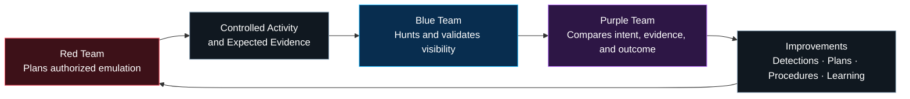
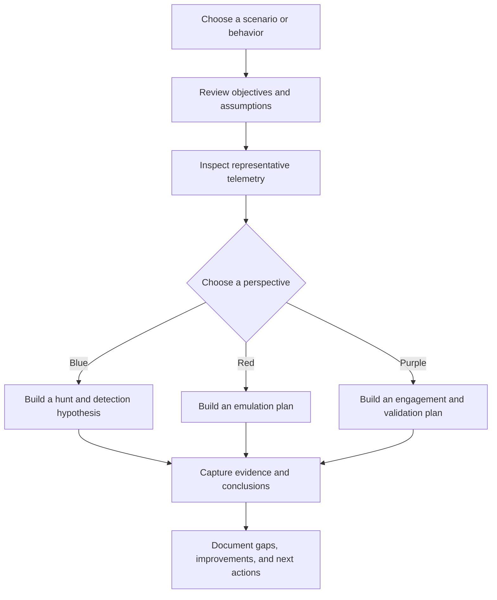

  

  <strong>An interactive cybersecurity framework for Blue, Red, and Purple teams.</strong> 
  Build familiarity with security data, investigate threats, plan adversary emulation, and turn shared evidence into stronger purple-team engagements.

  <a href="docs/platform-vision.md"><strong>Platform Vision</strong></a> ·
  <a href="docs/operations-model.md"><strong>Operating Model</strong></a> ·
  <a href="docs/roadmap.md"><strong>Roadmap</strong></a> ·
  <a href="https://m3ht4.com"><strong>M3HT4.com</strong></a>

---

# M3HT4

## Modern Hunting Terrain

**Built for 3 Teams. Powered by 4 Pillars.**

M3HT4 is a developing, vendor-neutral cybersecurity framework that connects **threat hunting**, **detection engineering**, **adversary emulation**, and **collaborative learning** in one structured experience.

It is designed to help practitioners understand the same security data from different operational perspectives:

- **Blue teams** investigate telemetry, test hypotheses, and improve detections.
- **Red teams** study defender visibility and use evidence to build realistic emulation plans.
- **Purple teams** connect offensive activity with defensive outcomes to plan, execute, and document engagements.

M3HT4 is not intended to become a giant database of every CVE, actor, or technique. The goal is a **lightweight, curated, maintainable framework** that teaches repeatable thinking and produces useful engagement artifacts.

  

## The 3 Teams

| Team | Primary perspective | M3HT4 value |
|---|---|---|
| 🔵 **Blue Team** | Observe, investigate, detect, and respond | Build data familiarity, hunting habits, detections, and evidence-backed conclusions |
| 🔴 **Red Team** | Understand and emulate adversary behavior | Translate objectives and techniques into defensible, observable emulation plans |
| 🟣 **Purple Team** | Coordinate offense and defense | Connect activity, telemetry, detections, findings, and improvements into one engagement loop |

## The 4 Pillars

| Pillar | Purpose | Typical output |
|---|---|---|
| 🔎 **Hunt** | Explore telemetry and test investigative hypotheses | Hunt notes, timelines, findings, and unanswered questions |
| 🛡️ **Detect** | Convert observed behavior into reusable defensive logic | Detection ideas, mappings, validation evidence, and tuning notes |
| ♟️ **Emulate** | Plan safe, authorized adversary behavior around clear objectives | Emulation plans, expected telemetry, safety controls, and success criteria |
| 📘 **Train** | Build practical understanding through guided, repeatable workflows | Exercises, walkthroughs, lessons learned, and analyst development artifacts |

## How the framework connects the teams

The same scenario should be useful from all three perspectives. A red-team action is not complete when it merely runs; it becomes valuable when defenders can examine the resulting data, compare expected and actual visibility, and turn the outcome into measurable improvement.

## What M3HT4 is becoming

M3HT4 is being developed in layers:

1. **A safe reference environment** for generating and validating realistic security evidence.
2. **A curated knowledge model** that connects behavior, telemetry, hunting questions, detections, and emulation planning.
3. **An interactive web experience** that guides users through scenarios without requiring access to the private lab.
4. **Reusable public artifacts** such as sanitized examples, engagement templates, walkthroughs, and case studies.

The physical lab supports development and validation, but **the lab is not the product**. The public framework should remain usable, understandable, and safe without exposing private infrastructure.

## Example workflow

## Scope and guardrails

M3HT4 is intended for authorized security research, defensive analysis, adversary-emulation planning, detection validation, and education.

Public content will emphasize:

- sanitized and reusable examples;
- behavior and evidence rather than exploit novelty;
- safe planning and validation workflows;
- vendor-neutral concepts where practical;
- clear separation between public documentation and private operations;
- original work or appropriately licensed open-source components.

M3HT4 will not publish credentials, private endpoints, live network details, raw private captures, destructive instructions, or environment-specific secrets.

## Current status

M3HT4 is in early development. The immediate focus is to establish the framework model, refine public documentation, build a safe validation environment, and deliver one complete end-to-end scenario before expanding the catalog.

| Workstream | Status |
|---|---|
| Brand and refined project vision | ✅ Established |
| Public documentation structure | 🟡 In progress |
| Safe validation environment | 🟡 In progress |
| Initial telemetry and hunting workflow | 🔵 Planned |
| Initial adversary-emulation planning workflow | 🔵 Planned |
| First complete purple-team scenario | 🔵 Planned |
| Interactive M3HT4 web application | 🔵 Planned |

See the [project status](docs/project-status.md) and [roadmap](docs/roadmap.md) for details.

## Documentation

| Document | Purpose |
|---|---|
| [Documentation hub](docs/README.md) | Start here for organized project documentation |
| [Platform vision](docs/platform-vision.md) | Product definition, boundaries, users, and long-term direction |
| [Operating model](docs/operations-model.md) | How Blue, Red, and Purple teams use the framework together |
| [Roadmap](docs/roadmap.md) | Incremental delivery plan |
| [Project status](docs/project-status.md) | Current progress and next milestone |
| [Technology strategy](docs/technology-stack.md) | Technology selection principles without locking the framework to one vendor |

## Development philosophy

- Build one useful workflow before building a large platform.
- Prefer curated depth over an unmaintainable data catalog.
- Make every feature serve at least one team and one pillar.
- Keep the public experience separate from private infrastructure.
- Use automation to reduce repetitive work, not to replace human judgment.
- Document assumptions, evidence, limitations, and lessons learned.
- Keep implementation simple enough to maintain by a small team.

## Responsible use

Use M3HT4 only in systems you own or are explicitly authorized to test. The framework is designed to improve collaboration, analysis, detection, and controlled emulation—not to enable unauthorized access.

---

  <strong>One terrain. Three teams. Four ways to improve.</strong> 
  <em>Build. Defend. Hunt. Evolve.</em>

