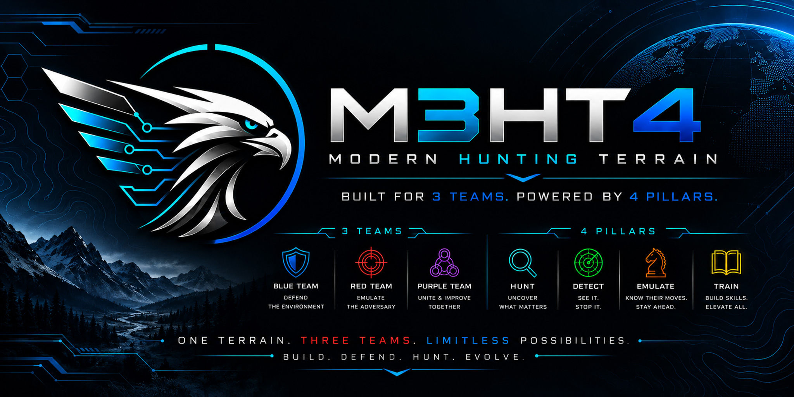
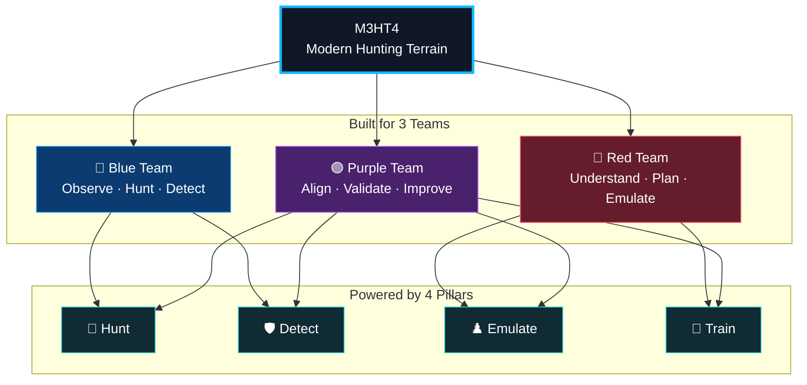
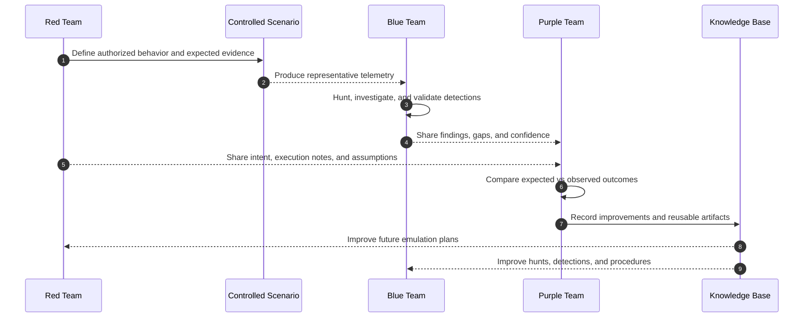
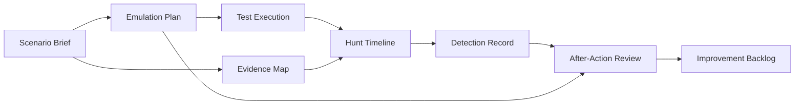
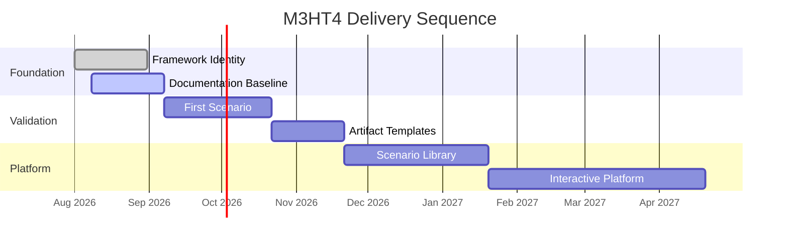
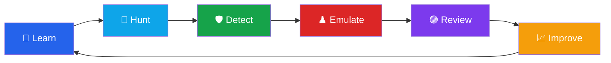
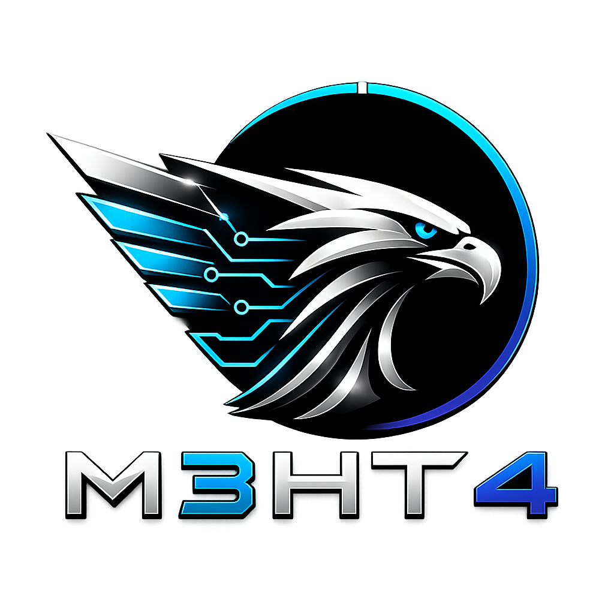

<p align="center">
  
</p>

<h1 align="center">M3HT4 — Modern Hunting Terrain</h1>

<p align="center">
  <strong>An interactive cybersecurity framework for Blue, Red, and Purple teams.</strong><br>
  Learn the data. Hunt the behavior. Plan the emulation. Improve together.
</p>

<p align="center">
  <a href="docs/framework/vision.md"></a>
  <a href="docs/framework/operating-model.md"></a>
  <a href="docs/framework/operating-model.md#the-four-pillars"></a>
  <a href="docs/roadmap/roadmap.md"></a>
  <a href="docs/roadmap/status.md"></a>
</p>

<p align="center">
  <a href="docs/roadmap/status.md"></a>
  <a href="docs/security/publication-safety.md"></a>
  <a href="LICENSE"></a>
  <a href="SECURITY.md"></a>
</p>

> [!WARNING]
> **M3HT4 is under active development.** The public framework, documentation, examples, and private reference environment are being built incrementally. Current material represents the validated direction of the project—not a finished production platform.

---

## What is M3HT4?

**M3HT4 (Modern Hunting Terrain)** is an interactive cybersecurity framework that helps **Blue, Red, and Purple teams** understand security data, investigate realistic attack scenarios, plan adversary emulation, validate detections, and continuously improve through shared, evidence-driven workflows.

Unlike traditional cybersecurity resources that focus on a single discipline, M3HT4 connects offensive planning, defensive analysis, and collaborative validation into one repeatable process.

The framework is intentionally designed to remain:

- 🎯 **Scenario-driven** instead of becoming a massive CVE or threat-intelligence repository.
- 🔵 **Built for Blue, Red, and Purple teams** from the beginning.
- 🔎 **Focused on evidence and behavior**, not just tools or exploits.
- 📚 **Lightweight and maintainable**, prioritizing quality over quantity.
- 🌐 **Vendor-neutral** where practical.
- 🔒 **Public-safe**, while using a private validation environment to verify scenarios before publication.

> **One terrain. Three teams. Four paths to improvement.**

## What can I do with M3HT4?

Whether you're defending an environment, planning an engagement, or learning how attacks appear in real telemetry, M3HT4 is designed to guide you through the complete workflow.

| Team | Example use cases |
|------|-------------------|
| 🔵 **Blue Team** | Explore realistic telemetry, build hunt hypotheses, validate detections, and understand attacker behavior. |
| 🔴 **Red Team** | Design authorized adversary-emulation plans, understand expected defender visibility, and prepare Purple-team engagements. |
| 🟣 **Purple Team** | Compare intent with observed evidence, identify gaps, validate coverage, and document improvements. |

As the framework evolves, users will be able to:

- 🔎 Investigate guided threat-hunting scenarios
- 📊 Explore how attacker activity appears in security data
- 🛡️ Build and validate detection logic
- ♟️ Develop adversary-emulation plans
- 🟣 Conduct Purple-team reviews
- 📘 Learn through reusable scenarios and walkthroughs



---

## Explore the framework

| Area | What you will find |
|---|---|
| **[🎯 Platform Vision](docs/framework/vision.md)** | Purpose, audience, boundaries, value, and long-term direction |
| **[🔵🔴🟣 Operating Model](docs/framework/operating-model.md)** | How the 3 Teams use the 4 Pillars together |
| **[🏗️ Reference Architecture](docs/architecture/reference-architecture.md)** | Public framework, private validation environment, and information boundaries |
| **[🗺️ Delivery Roadmap](docs/roadmap/roadmap.md)** | Phased implementation designed to avoid unnecessary complexity |
| **[🚧 Project Status](docs/roadmap/status.md)** | What is established, in progress, planned, and intentionally deferred |
| **[🔐 Publication Safety](docs/security/publication-safety.md)** | What may be published and what must remain private |
| **[🧪 Sanitized Examples](examples/README.md)** | Standards and planned structure for public scenarios |
| **[🌐 M3HT4.com Direction](website/README.md)** | How the website and future interactive platform fit the project |

---

## The 3 Teams

| Team | Perspective | How M3HT4 adds value |
|:---:|---|---|
| 🔵 **Blue Team** | Observe, investigate, detect, and respond | Learn representative telemetry, build hunt hypotheses, validate visibility, and improve detections |
| 🔴 **Red Team** | Understand and emulate adversary behavior | Build safe, evidence-aware emulation plans around objectives, guardrails, and expected defender visibility |
| 🟣 **Purple Team** | Coordinate offense and defense | Connect intent, activity, evidence, detections, and lessons into a measurable engagement loop |

## The 4 Pillars

| Pillar | Purpose | Representative output |
|:---:|---|---|
| 🔎 **Hunt** | Explore telemetry and test investigative hypotheses | Hunt plans, pivots, findings, timelines, unanswered questions |
| 🛡️ **Detect** | Convert observed behavior into reusable defensive logic | Detection ideas, mappings, test evidence, tuning notes |
| ♟️ **Emulate** | Plan authorized adversary behavior against clear objectives | Emulation plans, expected evidence, guardrails, success criteria |
| 📘 **Train** | Build practical understanding through guided use | Exercises, walkthroughs, analyst notes, lessons learned |

---

## How M3HT4 creates shared value



A complete scenario should create value for all three teams. Red defines intended behavior, Blue examines evidence, and Purple compares expectations with reality to produce measurable improvements.

<details>
<summary><strong>Example artifact flow</strong></summary>



</details>

---

## The Product Vision

M3HT4 is being developed in carefully validated stages.

### Phase 1 — Framework

Establish the public operating model, documentation, and reusable methodology.

### Phase 2 — Scenarios

Publish complete, evidence-driven scenarios that demonstrate the framework from multiple team perspectives.

### Phase 3 — Knowledge Base

Build a curated library of scenarios, hunt workflows, detection ideas, and emulation plans.

### Phase 4 — Interactive Platform

Transform the framework into an interactive web application where users can explore scenarios, understand evidence, develop hunt plans, and build Purple-team engagements.

> The private validation environment exists to develop and verify scenarios. The public M3HT4 framework is the product.

> [!NOTE]
> The private reference lab supports development and validation, but **the lab is not the product**. M3HT4 should remain useful without revealing or requiring access to private infrastructure.

## Project Status

| Workstream | Status |
|---|:---:|
| Refined identity and framework vision | ✅ Established |
| 3 Teams / 4 Pillars operating model | ✅ Established |
| Public documentation structure | 🟡 In progress |
| Safe validation environment | 🟡 In progress |
| First end-to-end hunting workflow | 🔵 Planned |
| First adversary-emulation planning workflow | 🔵 Planned |
| First complete Purple-team scenario | 🔵 Planned |
| Interactive M3HT4 web application | 🔵 Planned |



<p align="center">
  <a href="docs/roadmap/status.md"></a>
  <a href="docs/roadmap/roadmap.md"></a>
</p>

---

## Scope and guardrails

M3HT4 is intended for **authorized** defensive analysis, detection validation, threat hunting, adversary-emulation planning, security research, and education.

> [!CAUTION]
> Use M3HT4 only on systems you own or are explicitly authorized to assess. The framework is designed to support collaboration and controlled validation—not unauthorized access or harmful activity.

Public content emphasizes:

- sanitized examples;
- behavior and evidence over exploit novelty;
- safe planning and validation;
- vendor-neutral concepts where practical;
- original or properly licensed materials;
- strict separation between public documentation and private operations.

---

## Documentation map

| Start here | Description |
|---|---|
| [Documentation hub](docs/README.md) | Organized entry point for the public framework |
| [Platform vision](docs/framework/vision.md) | Product definition, audience, boundaries, and long-term direction |
| [Operating model](docs/framework/operating-model.md) | How the 3 Teams and 4 Pillars work together |
| [Reference architecture](docs/architecture/reference-architecture.md) | Public-safe architecture and separation boundaries |
| [Project status](docs/roadmap/status.md) | Current progress and immediate next milestone |
| [Roadmap](docs/roadmap/roadmap.md) | Incremental delivery phases |
| [Technology strategy](docs/architecture/technology-strategy.md) | Selection principles and sustainability |
| [Publication safety](docs/security/publication-safety.md) | Public-release rules |
| [M3HT4.com plan](website/README.md) | Website and future application direction |

## Where M3HT4 is going



Every completed scenario should strengthen future investigations, improve detections, refine adversary-emulation plans, and expand the collective knowledge available to Blue, Red, and Purple teams.

## Repository structure

```text
M3HT4/
├── .github/                  Workflows and community templates
├── assets/                   Public branding assets
├── docs/
│   ├── framework/            Vision and operating model
│   ├── architecture/         Reference architecture and technology strategy
│   ├── roadmap/              Status and phased delivery plan
│   └── security/             Publication-safety rules
├── examples/                 Sanitized scenario guidance
├── website/                  M3HT4.com direction
├── mkdocs.yml                Documentation navigation
└── README.md                 Public project landing page
```

## Development principles

- Build one useful, validated workflow before expanding the catalog.
- Prefer curated depth over an unmaintainable data dump.
- Make every feature support at least one team and one pillar.
- Keep public content separate from private infrastructure.
- Use automation to reduce repetitive work—not to replace analyst judgment.
- Document assumptions, evidence, limitations, and lessons learned.
- Favor simple, maintainable architecture that a small team can operate.

<p align="center">

<p align="center">
  
</p>

<h2 align="center">Modern Hunting Terrain</h2>

<p align="center">
  <strong>One Terrain. Three Teams. Four Pillars.</strong>
</p>

<p align="center">
  <em>Helping Blue, Red, and Purple teams build shared understanding through evidence-driven cybersecurity.</em>
</p>

<p align="center">
  🔵 <strong>Blue Team</strong>
  &nbsp;&nbsp;&nbsp;•&nbsp;&nbsp;&nbsp;
  🔴 <strong>Red Team</strong>
  &nbsp;&nbsp;&nbsp;•&nbsp;&nbsp;&nbsp;
  🟣 <strong>Purple Team</strong>
</p>

<p align="center">
  🔎 <strong>Hunt</strong>
  &nbsp;&nbsp;&nbsp;•&nbsp;&nbsp;&nbsp;
  🛡️ <strong>Detect</strong>
  &nbsp;&nbsp;&nbsp;•&nbsp;&nbsp;&nbsp;
  ♟️ <strong>Emulate</strong>
  &nbsp;&nbsp;&nbsp;•&nbsp;&nbsp;&nbsp;
  📘 <strong>Train</strong>
</p>

<br>

<p align="center"> 
  ⭐ <b>If you find M3HT4 useful, consider starring the repository.</b> 
</p>
