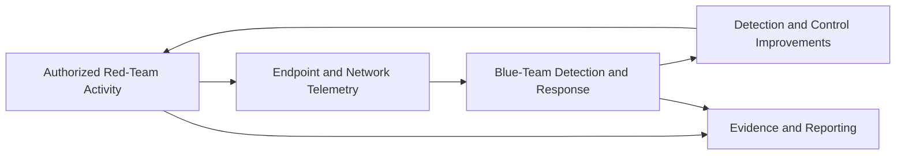
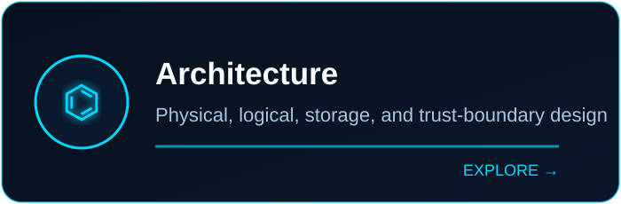
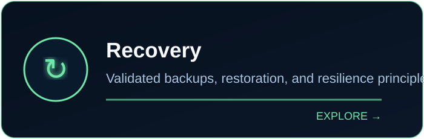
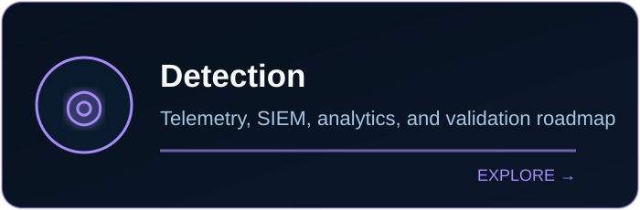
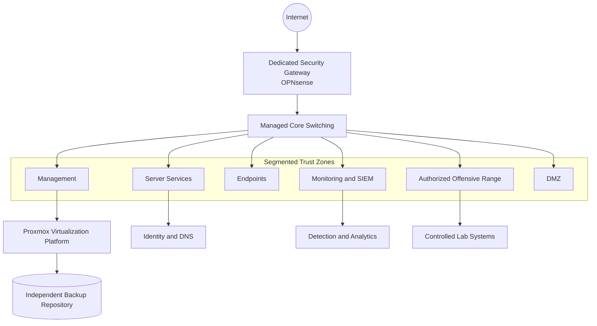
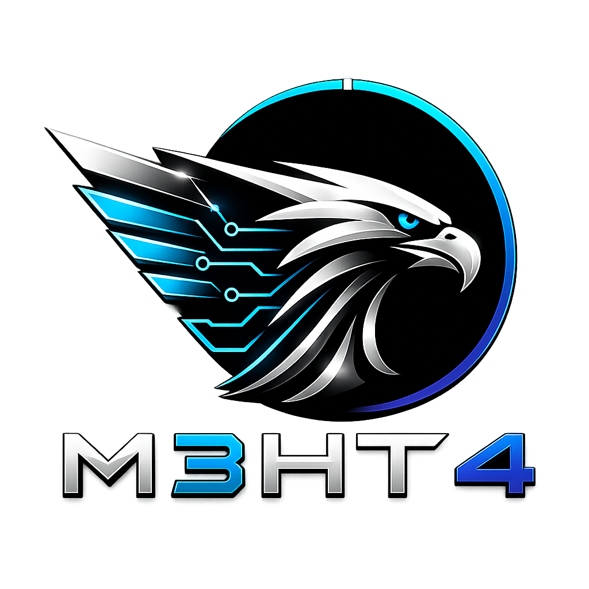

<div align="center">
  
</div>

<br>

<div align="center">

[](https://www.m3ht4.com)
[](docs/project-status.md)
[](docs/project-log/phase-1-infrastructure.md)
[](docs/README.md)
[](docs/security/publication-safety.md)
[](LICENSE)

# M3HT4

### **Modern • Managed • Multi-Domain**  
### **Hybrid • Threat • Hunting • Training**

**Build. Defend. Hunt. Evolve.**

</div>

---

## Mission

**M3HT4** is an enterprise-inspired cybersecurity platform and cyber range built to support both **blue-team defense** and **authorized red-team / penetration-testing workflows**. It connects infrastructure engineering, identity, network security, detection engineering, adversary emulation, threat hunting, automation, analytics, and recovery into one coherent environment.

The project follows one rule:

> **Every component must support a defined operational or learning objective.**

M3HT4 is not a tool collection. It is a deliberately engineered platform for building, defending, observing, attacking under authorization, validating controls, recovering, and continuously improving a realistic security environment.

The project is intentionally **purple-team oriented**: red-team activity should generate evidence, blue-team systems should observe and respond, and both sides should produce measurable improvements.

## Core capabilities

<table>
<tr>
<td width="25%" align="center"><strong>BUILD</strong><br><br>Virtualization<br>Identity<br>Networking<br>Storage</td>
<td width="25%" align="center"><strong>DEFEND</strong><br><br>Telemetry<br>Detection<br>Threat hunting<br>Incident response</td>
<td width="25%" align="center"><strong>TEST</strong><br><br>Reconnaissance<br>Exploitation<br>Adversary emulation<br>Pentest reporting</td>
<td width="25%" align="center"><strong>EVOLVE</strong><br><br>Purple-team validation<br>Automation<br>Analytics<br>Continuous improvement</td>
</tr>
</table>

## Blue, red, and purple team utility

| Discipline | M3HT4 utility |
|---|---|
| **Blue team** | Centralized logging, endpoint telemetry, network monitoring, SIEM workflows, detection engineering, threat hunting, incident-response practice, and recovery validation |
| **Red team / pentest** | Authorized reconnaissance, vulnerability validation, exploitation practice, privilege escalation, lateral movement, post-exploitation, attack-path analysis, and professional reporting |
| **Purple team** | Execute controlled techniques, verify telemetry, measure alert coverage, tune detections, validate segmentation, and document lessons learned |



M3HT4 does not treat offensive and defensive work as separate silos. The strongest learning happens when attack activity, telemetry, detection, investigation, and remediation are evaluated together.

## Explore M3HT4

<table>
<tr>
<td width="50%"><a href="docs/architecture/README.md"></a></td>
<td width="50%"><a href="docs/recovery/backup-and-recovery.md"></a></td>
</tr>
<tr>
<td width="50%"><a href="docs/technology-stack.md"></a></td>
<td width="50%"><a href="docs/roadmap.md"></a></td>
</tr>
</table>

## Architecture overview



> **Public-safety note:** This architecture is intentionally generalized. Live addresses, device identifiers, credentials, firewall policy, external endpoints, VPN details, and management paths are not published.

## Current milestone

### Infrastructure v1.0 — Complete

- Clean Proxmox foundation
- Dedicated storage roles
- Restored identity services
- Validated external VM backup
- End-to-end disaster recovery test
- Golden recovery snapshot
- Automated independent backups

| Workstream | State |
|---|:---:|
| Virtualization foundation | ✅ |
| Storage separation | ✅ |
| Identity services | ✅ |
| Disaster recovery | ✅ |
| Automated backups | ✅ |
| Dedicated firewall | 🟡 Next |
| Managed segmentation | 🟡 Next |
| Detection engineering | 🔵 Planned |
| Threat-hunting analytics | 🔵 Planned |
| M3HT4.com | 🔵 Planned |

[View detailed status →](docs/project-status.md)

## Platform layers

```mermaid
flowchart LR
    Foundation[Infrastructure Foundation]
    Network[Enterprise Networking]
    Systems[Core Systems]
    Telemetry[Detection Telemetry]
    Validation[Adversary Emulation]
    Hunting[Threat Hunting]
    Automation[Automation and AI]
    Public[M3HT4.com]

    Foundation --> Network --> Systems --> Telemetry --> Validation --> Hunting --> Automation --> Public
```



## Technology direction

| Layer | Direction |
|---|---|
| Virtualization | Proxmox VE, QEMU/KVM, LVM-Thin |
| Identity | Windows Server, Active Directory, DNS |
| Network security | OPNsense, managed switching, VLANs |
| Endpoints | Windows, Linux, Kali |
| Endpoint telemetry | Sysmon, Windows Event Forwarding |
| Network telemetry | Zeek, Suricata |
| SIEM | Wazuh or compatible stack |
| Offensive security | Kali, controlled targets, pentest tooling, adversary emulation |
| Validation | MITRE ATT&CK mapping, purple-team exercises, evidence collection |
| Analytics | Python, Jupyter |
| Automation | Bash, PowerShell, Python, APIs |
| AI assistance | Local models for triage, reporting, and analysis |

[Read the technology strategy →](docs/technology-stack.md)

## Documentation

| Section | Contents |
|---|---|
| [Documentation hub](docs/README.md) | Central navigation |
| [Architecture](docs/architecture/README.md) | Physical, logical, storage, trust boundaries |
| [Infrastructure v1.0](docs/project-log/phase-1-infrastructure.md) | Build and recovery case study |
| [Backup and recovery](docs/recovery/backup-and-recovery.md) | Resilience design |
| [Publication safety](docs/security/publication-safety.md) | Public/private data separation |
| [Threat model](docs/security/public-repository-threat-model.md) | Public repository risk controls |
| [Roadmap](docs/roadmap.md) | Planned phases |
| [M3HT4.com](website/README.md) | Public website strategy |

## Security-first publication model

### Public repository

- Sanitized diagrams
- Reusable documentation
- Detection and automation examples
- Lessons learned
- Generic configuration templates
- Portfolio-ready case studies

### Private operations repository

- Real internal addressing
- Detailed inventory
- Environment-specific maintenance and recovery notes
- Operational diagrams
- Change records

### Never stored in Git

- Credentials, tokens, private keys, cookies, or recovery codes
- VPN secrets or certificate private keys
- Public origin addresses or management endpoints
- Authentication databases or password hashes
- Raw VM backups, memory dumps, disk images, or private packet captures

## Repository map

```text
M3HT4/
├── .github/                 GitHub workflows and community templates
├── assets/
│   ├── branding/            Official visual identity
│   └── cards/               README navigation visuals
├── docs/
│   ├── architecture/        Platform and trust-boundary design
│   ├── project-log/         Milestone case studies
│   ├── recovery/            Backup and resilience
│   └── security/            Publication safety
├── examples/                Sanitized reusable examples
├── website/                 M3HT4.com planning
├── mkdocs.yml               Documentation-site configuration
└── README.md
```

## Engineering principles

1. **Reliability over speed**
2. **Purpose over unnecessary complexity**
3. **Automation over repetitive manual work**
4. **Understand before implementing**
5. **Document while building**
6. **Keep public content sanitized**
7. **Make critical systems recoverable**
8. **Validate assumptions through testing**

## Responsible use

M3HT4 is intended for authorized blue-team training, red-team and penetration-testing practice, purple-team validation, detection engineering, threat hunting, and controlled security testing. Never test systems without explicit permission.

---

<div align="center">
  

### [M3HT4.com](https://www.m3ht4.com)

**Built with purpose. Secured with discipline. Shared to empower.**
</div>
