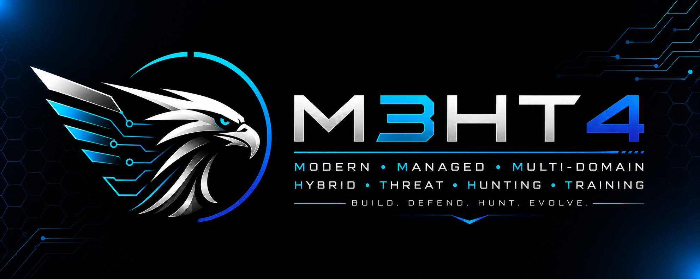
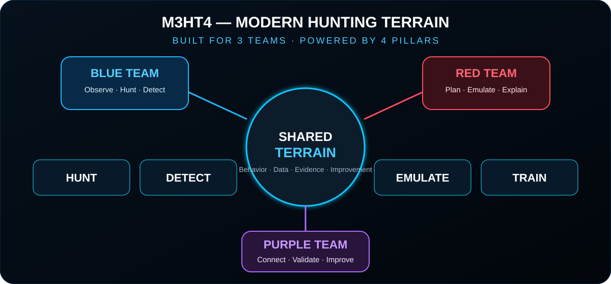
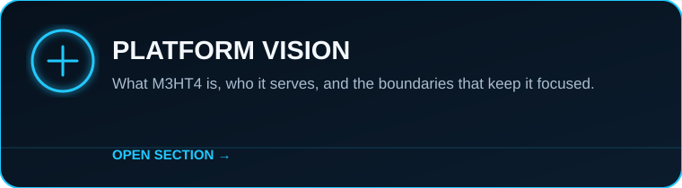
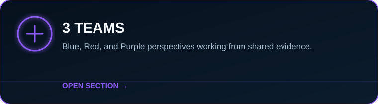
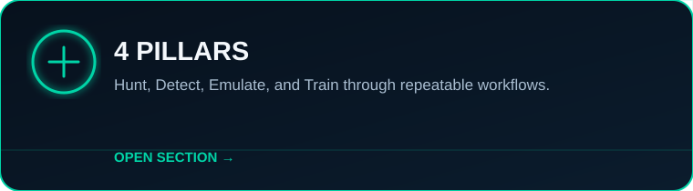
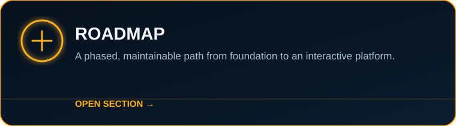
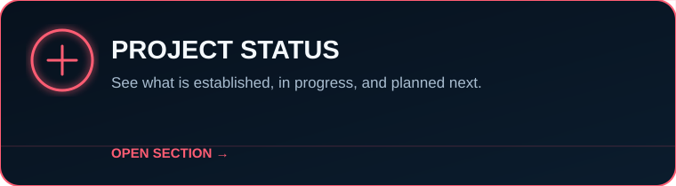
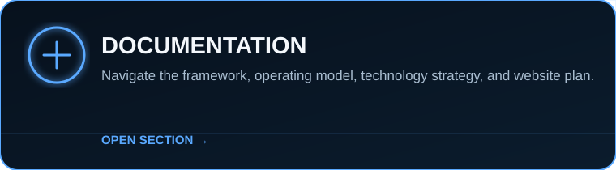
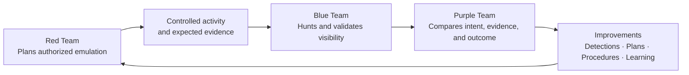
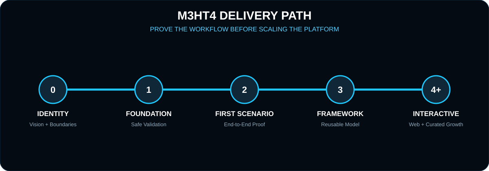

<p align="center">
  
</p>

<h1 align="center">M3HT4 — Modern Hunting Terrain</h1>

<p align="center">
  <strong>An interactive cybersecurity framework for Blue, Red, and Purple teams.</strong><br>
  Learn the data. Hunt the behavior. Plan the emulation. Improve together.
</p>

<p align="center">
  <a href="docs/framework/vision.md"></a>
  <a href="docs/framework/operating-model.md"></a>
  <a href="docs/framework/operating-model.md#the-four-pillars"></a>
  <a href="docs/roadmap/roadmap.md"></a>
  <a href="docs/roadmap/status.md"></a>
  <a href="docs/README.md"></a>
</p>

> [!WARNING]
> **M3HT4 is under active development.** The framework, documentation, examples, and reference environment are being built incrementally. Current material represents the project direction—not a finished production platform. Expect the structure and examples to evolve as end-to-end scenarios are validated.

<p align="center">
  
  
  
  
</p>

---

## What is M3HT4?

**M3HT4 (Modern Hunting Terrain)** is a developing cybersecurity framework that helps **Blue, Red, and Purple teams** build a shared understanding of security data, threat hunting, adversary behavior, and engagement planning.

The goal is not to become an enormous repository of every CVE, threat actor, or technique. M3HT4 is designed to remain a **curated, lightweight, and maintainable framework** that connects realistic evidence to repeatable workflows.

- **Blue teams** use representative telemetry to investigate behavior, test hypotheses, and improve detections.
- **Red teams** study defender visibility and turn objectives into safe, evidence-aware adversary-emulation plans.
- **Purple teams** connect offensive intent with defensive evidence to design engagements, validate coverage, and document improvements.

<p align="center"><strong>Built for 3 Teams. Powered by 4 Pillars.</strong></p>

<p align="center">
  
</p>

---

## Explore M3HT4

<table>
<tr>
<td width="50%"><a href="docs/framework/vision.md"></a></td>
<td width="50%"><a href="docs/framework/operating-model.md"></a></td>
</tr>
<tr>
<td width="50%"><a href="docs/framework/operating-model.md#the-four-pillars"></a></td>
<td width="50%"><a href="docs/roadmap/roadmap.md"></a></td>
</tr>
<tr>
<td width="50%"><a href="docs/roadmap/status.md"></a></td>
<td width="50%"><a href="docs/README.md"></a></td>
</tr>
</table>

---

## The 3 Teams

| Team | Perspective | How M3HT4 helps |
|:---:|---|---|
| 🔵 **Blue Team** | Observe, investigate, detect, and respond | Build familiarity with telemetry, develop hunt logic, validate visibility, and convert findings into defensible improvements |
| 🔴 **Red Team** | Understand and emulate adversary behavior | Build realistic plans around objectives, expected evidence, safety controls, and defender visibility |
| 🟣 **Purple Team** | Coordinate offense and defense | Connect intent, activity, evidence, detections, and lessons learned into a measurable engagement loop |

## The 4 Pillars

| Pillar | Purpose | Representative output |
|:---:|---|---|
| 🔎 **Hunt** | Explore telemetry and test investigative hypotheses | Hunt plans, timelines, findings, pivots, and unanswered questions |
| 🛡️ **Detect** | Convert observed behavior into reusable defensive logic | Detection ideas, mappings, test evidence, and tuning notes |
| ♟️ **Emulate** | Plan safe, authorized adversary behavior against clear objectives | Emulation plans, expected telemetry, guardrails, and success criteria |
| 📘 **Train** | Build practical understanding through guided, repeatable use | Exercises, walkthroughs, analyst notes, and lessons learned |

<p align="center">
  
</p>

---

## How the framework works



A scenario should create value for all three teams. The red-team plan defines intended behavior. The blue team examines the resulting evidence. The purple team compares expectations with reality and turns gaps into concrete improvements.

---

## What the project will deliver

M3HT4 is being developed in layers:

1. **Safe reference environment** — generate and validate realistic, controlled security evidence.
2. **Curated knowledge model** — connect behavior, telemetry, hunting questions, detections, and emulation planning.
3. **Interactive platform** — guide users through scenarios without exposing or requiring access to the private lab.
4. **Reusable public artifacts** — provide sanitized templates, examples, walkthroughs, and case studies.

> [!NOTE]
> The private reference lab supports development and validation, but **the lab is not the product**. The public framework should remain useful without revealing private infrastructure.

## Current progress

| Workstream | Status |
|---|:---:|
| Refined identity and framework vision | ✅ Established |
| Public documentation structure | 🟡 In progress |
| Safe validation environment | 🟡 In progress |
| First telemetry and hunting workflow | 🔵 Planned |
| First adversary-emulation planning workflow | 🔵 Planned |
| First complete purple-team scenario | 🔵 Planned |
| Interactive M3HT4 web application | 🔵 Planned |

<p align="center">
  <a href="docs/roadmap/status.md"></a>
  <a href="docs/roadmap/roadmap.md"></a>
</p>

<p align="center">
  
</p>

---

## Scope and guardrails

M3HT4 is intended for **authorized** defensive analysis, detection validation, threat hunting, adversary-emulation planning, security research, and education.

Public material emphasizes sanitized examples, behavior and evidence over exploit novelty, safe planning and validation, vendor-neutral concepts where practical, and a strict separation between public documentation and private operations.

> [!CAUTION]
> Use M3HT4 only with systems you own or are explicitly authorized to test. The framework is designed to improve collaboration and controlled validation—not to enable unauthorized access.

## Documentation map

| Start here | Description |
|---|---|
| [Documentation hub](docs/README.md) | Organized entry point for all project documentation |
| [Platform vision](docs/framework/vision.md) | Product definition, users, boundaries, and long-term direction |
| [Operating model](docs/framework/operating-model.md) | How the three teams use the four pillars together |
| [Architecture](docs/architecture/reference-architecture.md) | Public-safe logical model and separation boundaries |
| [Project status](docs/roadmap/status.md) | Current progress and immediate next milestone |
| [Roadmap](docs/roadmap/roadmap.md) | Incremental delivery phases and sequencing |
| [Technology strategy](docs/architecture/technology-strategy.md) | Selection principles without unnecessary vendor lock-in |
| [M3HT4.com plan](website/README.md) | Public website and future interactive application direction |

## Repository structure

```text
M3HT4/
├── .github/                  Workflows and community templates
├── assets/                   Branding, cards, and public-safe diagrams
├── docs/                     Vision, model, architecture, and roadmap
├── examples/                 Sanitized scenario templates and future examples
├── website/                  M3HT4.com product direction
├── mkdocs.yml                Documentation-site configuration
└── README.md                 Public project landing page
```

## Development principles

- Build one useful, validated workflow before expanding the catalog.
- Prefer curated depth over an unmaintainable data dump.
- Make every feature support at least one team and one pillar.
- Keep public content separate from private infrastructure.
- Use automation to reduce repetitive work—not to replace analyst judgment.
- Document assumptions, evidence, limitations, and lessons learned.
- Favor simple, maintainable architecture that a small team can operate.

---

<p align="center">
  <strong>One terrain. Three teams. Four paths to improvement.</strong><br>
  <em>Build. Defend. Hunt. Evolve.</em>
</p>
