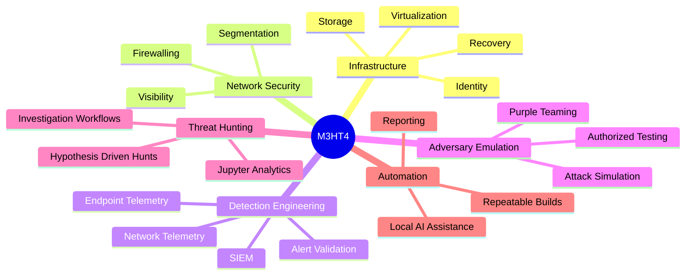
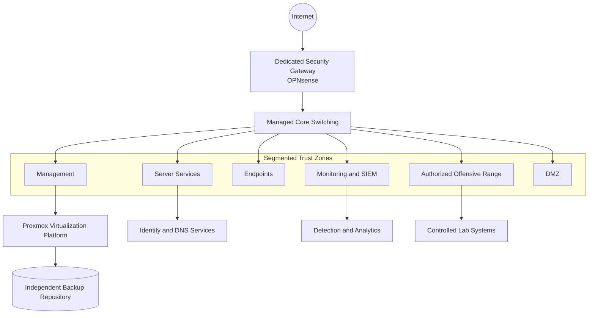

<div align="center">


<br>

[](https://www.m3ht4.com)
[](docs/project-status.md)
[](docs/project-log/phase-1-infrastructure.md)
[](docs/README.md)
[](LICENSE)

# M3HT4

### **Modern • Managed • Multi-Domain**  
### **Hybrid • Threat • Hunting • Training**

**Build. Defend. Hunt. Evolve.**

</div>

---

## What is M3HT4?

**M3HT4** is an enterprise-inspired cybersecurity platform and cyber range built to explore how modern infrastructure, identity, networking, detection engineering, adversary emulation, automation, analytics, and recovery work together.

It is not a collection of disconnected tools. Each component must support a defined operational or learning objective.

<div align="center">

| **Build** | **Defend** | **Hunt** | **Evolve** |
|:---:|:---:|:---:|:---:|
| Design reliable infrastructure | Engineer layered visibility | Investigate activity across hosts and networks | Automate, measure, document, and improve |
| Virtualization, identity, networking | Telemetry, SIEM, segmentation | Threat hunting and purple-team workflows | Analytics, AI, repeatable runbooks |

</div>

## Project pillars



## Architecture overview



> The public architecture is intentionally sanitized. Real addressing, device identifiers, credentials, firewall policy, external endpoints, and operational secrets are not published.

## Current status

| Capability | Status | Notes |
|---|:---:|---|
| Virtualization foundation | ✅ Complete | Clean Proxmox baseline |
| Storage separation | ✅ Complete | Dedicated host, VM, infrastructure, and backup roles |
| Identity services | ✅ Complete | Restored and validated from backup |
| Disaster recovery | ✅ Validated | End-to-end VM recovery tested |
| Automated backups | ✅ Active | Independent backup target |
| Enterprise firewall | 🟡 Planned | Dedicated OPNsense deployment |
| Network segmentation | 🟡 Planned | Managed switching and trust zones |
| Detection engineering | 🔵 Roadmap | Endpoint and network telemetry |
| Public platform | 🔵 Roadmap | M3HT4.com |

See the live [project status](docs/project-status.md) and [roadmap](docs/roadmap.md).

## Explore the project

| Start here | Description |
|---|---|
| [Documentation Hub](docs/README.md) | The organized entry point for all project documentation |
| [Architecture](docs/architecture/README.md) | Physical, logical, storage, and trust-boundary design |
| [Infrastructure v1.0](docs/project-log/phase-1-infrastructure.md) | What was built, validated, and learned |
| [Backup and Recovery](docs/recovery/backup-and-recovery.md) | Sanitized disaster-recovery design |
| [Security and Publication Safety](docs/security/publication-safety.md) | How the project avoids exposing the live environment |
| [Technology Strategy](docs/technology-stack.md) | Platforms and tools selected for each capability |
| [Roadmap](docs/roadmap.md) | Planned phases and outcomes |
| [M3HT4.com](website/README.md) | Public website strategy |

## Technology strategy

<div align="center">

| Layer | Technologies |
|---|---|
| Virtualization | Proxmox VE, QEMU/KVM, LVM-Thin |
| Identity | Windows Server, Active Directory, DNS |
| Network Security | OPNsense, managed switching, VLANs |
| Endpoints | Windows, Linux, Kali |
| Detection | Sysmon, WEF, Wazuh, Zeek, Suricata |
| Analytics | Jupyter, Python, structured datasets |
| Automation | PowerShell, Bash, Python, APIs |
| Remote Administration | Zero-trust remote access patterns |
| AI Assistance | Local models for analysis and documentation |

</div>

Technology selection is driven by purpose, interoperability, recoverability, and realistic enterprise workflows—not by tool count.

## Security-first publication model

M3HT4 uses a strict separation between public project content and private operations.

### Public repository

- Sanitized diagrams
- Reusable documentation
- Detection content
- Automation examples
- Lessons learned
- Generic configuration templates
- Portfolio-ready case studies

### Private operations repository

- Real internal addressing
- Detailed inventory
- Environment-specific recovery notes
- Internal change records
- Operational diagrams

### Never stored in Git

- Passwords, tokens, API keys, cookies, or recovery codes
- Private keys or certificate secrets
- VPN credentials
- Public origin addresses or management endpoints
- Authentication databases or password hashes
- Raw VM backups, disk images, memory dumps, or private packet captures

Read the full [publication safety standard](docs/security/publication-safety.md).

## Repository structure

```text
M3HT4/
├── .github/                 # Issue templates, workflows, repository standards
├── assets/
│   ├── branding/            # Official icon and banner
│   └── diagrams/            # Sanitized visual assets
├── docs/
│   ├── architecture/        # Physical, logical, storage, trust boundaries
│   ├── project-log/         # Milestone case studies
│   ├── recovery/            # Backup and recovery documentation
│   ├── security/            # Publication and disclosure safety
│   └── README.md            # Documentation hub
├── examples/                # Sanitized examples and templates
├── website/                 # M3HT4.com planning
├── CONTRIBUTING.md
├── SECURITY.md
├── CODE_OF_CONDUCT.md
└── README.md
```

## Project philosophy

1. **Reliability over speed**
2. **Purpose over unnecessary complexity**
3. **Automation over repetitive manual work**
4. **Understand before implementing**
5. **Document while building**
6. **Keep public content sanitized**
7. **Make every critical capability recoverable**
8. **Validate assumptions through testing**

## Responsible use

M3HT4 is intended for authorized learning, defensive validation, detection engineering, and controlled security testing. Never test systems without explicit permission.

---

<div align="center">


### **M3HT4.com**

**Built with purpose. Secured with discipline. Shared to empower.**

</div>
