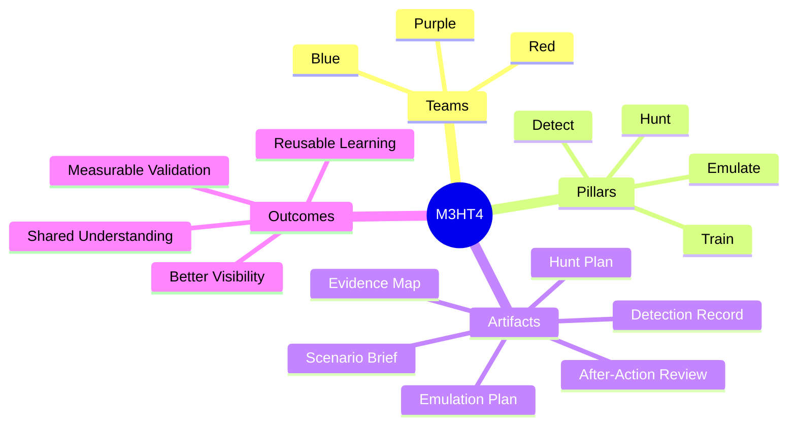

# M3HT4 Documentation

<strong>Modern Hunting Terrain</strong> One framework. Three team perspectives. Four operational pillars.

> [!WARNING]
> M3HT4 is in early development. Documentation describes the intended operating model and will evolve as end-to-end scenarios are validated.

## Navigate the framework

| Section | Purpose |
|---|---|
| [Platform Vision](framework/vision.md) | Defines what M3HT4 is, who it serves, and what makes it different |
| [Operating Model](framework/operating-model.md) | Explains the 3 Teams, 4 Pillars, shared lifecycle, and artifacts |
| [Reference Architecture](architecture/reference-architecture.md) | Shows how the public framework relates to private validation |
| [Technology Strategy](architecture/technology-strategy.md) | Sets vendor-neutral, maintainable selection principles |
| [Project Status](roadmap/status.md) | Shows current maturity and the next concrete milestone |
| [Roadmap](roadmap/roadmap.md) | Defines incremental delivery phases |
| [Publication Safety](security/publication-safety.md) | Defines public-release boundaries |
| [Sanitized Examples](../examples/README.md) | Establishes requirements for future public scenarios |
| [M3HT4.com Direction](../website/README.md) | Explains the public website and interactive application path |

## Framework at a glance

## Recommended reading paths

<strong>New visitor</strong>

1. [Platform Vision](framework/vision.md)
2. [Operating Model](framework/operating-model.md)
3. [Project Status](roadmap/status.md)

<strong>Blue-team practitioner</strong>

1. [Operating Model — Blue Team](framework/operating-model.md#blue-team)
2. [Operating Model — Hunt and Detect](framework/operating-model.md#the-four-pillars)
3. [Reference Architecture](architecture/reference-architecture.md)

<strong>Red or Purple-team practitioner</strong>

1. [Operating Model — Red and Purple Teams](framework/operating-model.md)
2. [Shared Scenario Lifecycle](framework/operating-model.md#shared-scenario-lifecycle)
3. [Roadmap](roadmap/roadmap.md)

