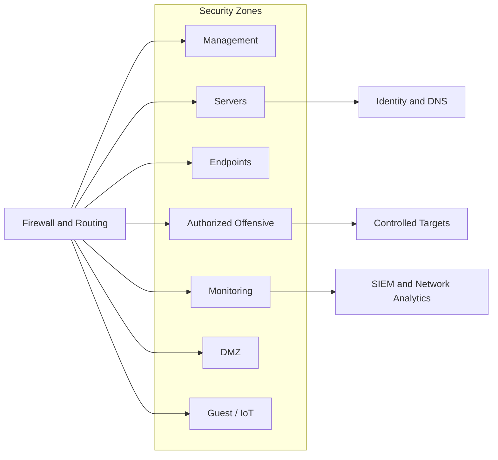

# Logical Topology

## Planned controls

- Default-deny inter-zone policy
- Explicit management access paths
- Restricted offensive-zone egress
- No direct management exposure to the Internet
- Logging at trust-boundary crossings
- Separate public hosting from the home lab
