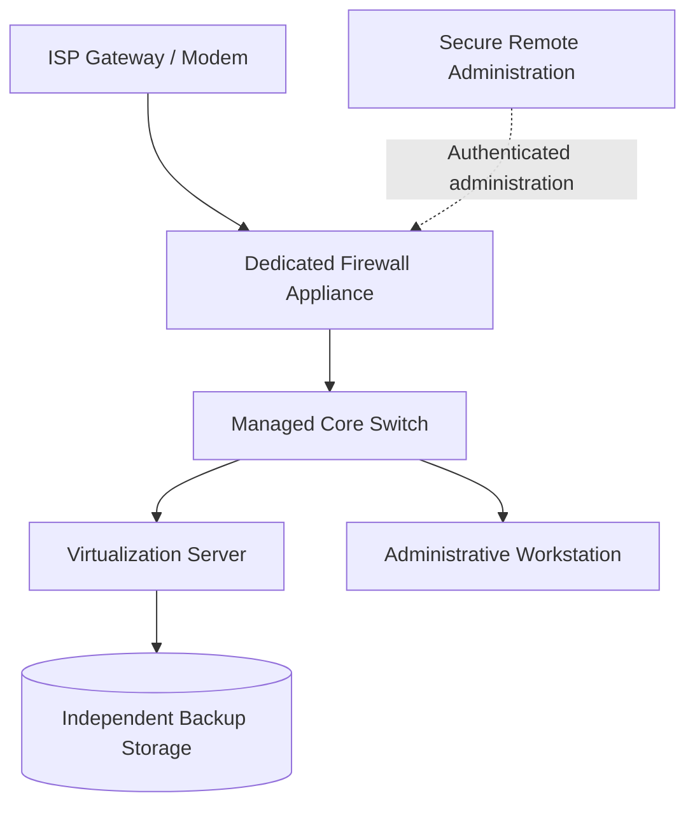

# Physical Topology

The public topology uses generic roles and intentionally omits live interfaces, port numbers, serial numbers, internal addresses, and management endpoints.

## Role summary

| Component | Role |
|---|---|
| Firewall appliance | Routing, policy enforcement, segmentation, VPN |
| Managed switch | VLAN distribution and wired access |
| Virtualization server | Hosts identity, endpoints, monitoring, and lab systems |
| Administrative workstation | Restricted management and engineering |
| Backup storage | Independent VM and configuration recovery |
