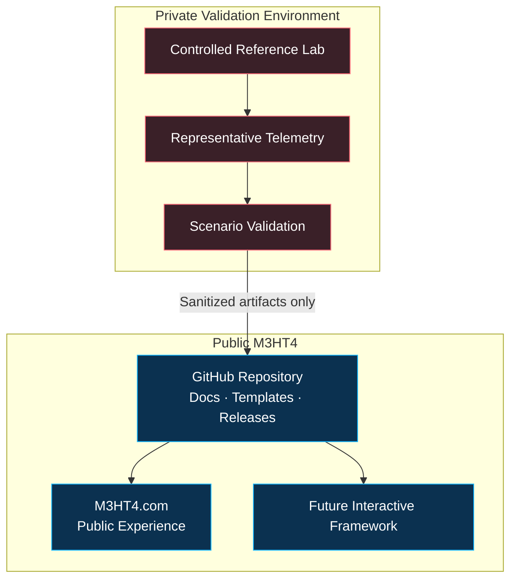

# Reference Architecture

## Purpose

The M3HT4 architecture separates the **public framework** from the **private validation environment**.

## Information boundary

| Information | Public | Private |
|---|:---:|:---:|
| Generalized logical diagrams | ✅ | |
| Sanitized scenario artifacts | ✅ | |
| Vendor-neutral workflows | ✅ | |
| Real credentials or tokens | | ✅ |
| Internal addressing and hostnames | | ✅ |
| VPN and management access paths | | ✅ |
| Raw private packet captures or VM images | | ✅ |
| Environment-specific firewall rules | | ✅ |

## Design principles

- **Separation:** public content never requires exposure of private operational details.
- **Sanitization:** examples use fictional or reserved identifiers.
- **Portability:** workflows should survive changes in products or lab infrastructure.
- **Traceability:** published artifacts explain assumptions, evidence, limitations, and outcomes.
- **Maintainability:** architecture grows only when a validated use case requires it.

> [!IMPORTANT]
> The private lab validates M3HT4. It is not itself the public M3HT4 product.
