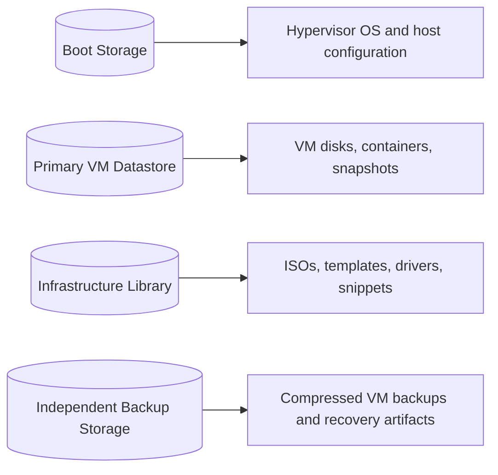

# Storage Architecture

## Design rationale

| Tier | Purpose | Recovery expectation |
|---|---|---|
| Boot | Hypervisor OS and configuration | Reinstallable |
| VM datastore | Active workloads | Protected by backup |
| Infrastructure | Installation media and reusable content | Rebuildable |
| Backup | Independent recovery archives | Critical |

This separation prevents active workloads from depending on the boot disk and makes host recovery significantly simpler.
