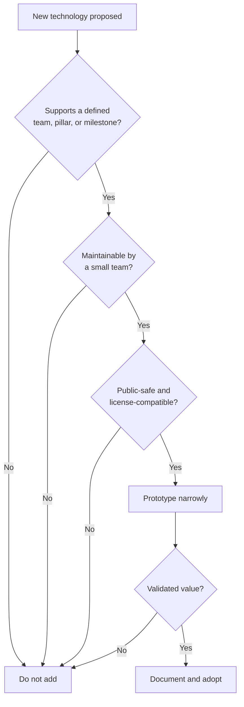

# Technology Strategy

Technology choices should serve the framework rather than define it.

## Selection principles

1. Prefer open standards and portable formats.
2. Remain vendor-neutral where practical.
3. Use open-source components only under licenses compatible with intended use.
4. Keep cost and operational complexity realistic for a small team.
5. Add technology only when a validated workflow requires it.
6. Keep internal AI assistance separate from public product claims.
7. Design public artifacts so they remain useful without the private lab.

## Technology categories

| Category | Role |
|---|---|
| Markdown and Git | Documentation, review, and version history |
| GitHub | Collaboration, issues, releases, and public source |
| Mermaid | Native visual explanation within GitHub |
| Controlled virtualization | Private scenario validation |
| Security telemetry tools | Evidence generation and analysis |
| Web technologies | Future public interactive experience |

## Decision filter

