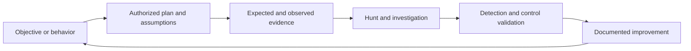

# Operating Model

M3HT4 is built for **three teams** and powered by **four pillars**.

## The three teams

### Blue Team

Blue-team users study representative evidence, develop hunt hypotheses, investigate behavior, validate visibility, and translate findings into improved detections or procedures.

### Red Team

Red-team users connect objectives and adversary behavior to expected defender visibility. The emphasis is on safe planning, assumptions, evidence requirements, guardrails, and measurable outcomes.

### Purple Team

Purple-team users reconcile offensive intent with defensive evidence. They organize engagement plans, identify observability gaps, validate controls, and capture improvements.

## The four pillars

### Hunt

Ask focused questions of telemetry and document the investigative path.

### Detect

Turn observable behavior into reusable, testable defensive logic.

### Emulate

Plan controlled adversary behavior with clear scope, evidence expectations, and safety controls.

### Train

Build practical understanding through guided scenarios, walkthroughs, templates, and reflection.

## Shared scenario loop

## Scenario quality test

A mature M3HT4 scenario should answer:

1. What behavior or objective is being examined?
2. What evidence should exist?
3. How would a defender investigate it?
4. What could be detected or validated?
5. How would an authorized emulator plan it safely?
6. What should a purple team measure and improve?
