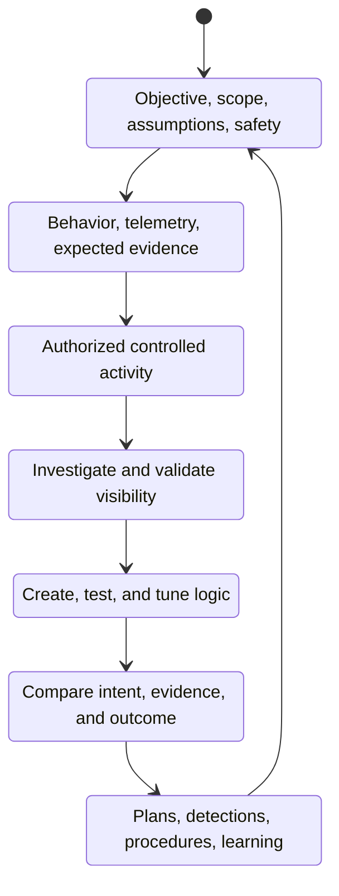
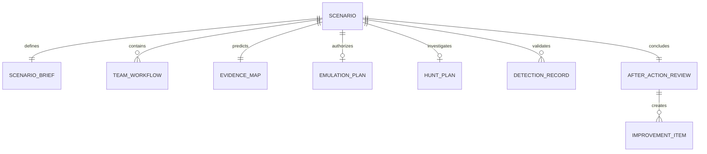

# Operating Model

## Built for Three Teams

### Blue Team

Blue teams use M3HT4 to:

- understand available telemetry;
- form focused hunt hypotheses;
- investigate representative behavior;
- validate visibility;
- turn findings into detections or procedure improvements.

**Representative outputs:** hunt plans, timelines, findings, pivots, detection ideas, visibility-gap notes.

### Red Team

Red teams use M3HT4 to:

- translate objectives into safe emulation plans;
- understand defender visibility;
- define expected evidence;
- document guardrails and success criteria;
- communicate execution intent clearly.

**Representative outputs:** emulation plans, expected-evidence maps, guardrails, success criteria, engagement notes.

### Purple Team

Purple teams use M3HT4 to:

- align offensive intent with defensive evidence;
- compare expected and observed outcomes;
- validate coverage;
- document gaps;
- convert lessons into a measurable improvement backlog.

**Representative outputs:** engagement plans, coverage matrices, gap analyses, after-action reviews, improvement backlogs.

## The Four Pillars

| Pillar | Core question | Typical artifact |
|---|---|---|
| **Hunt** | What does the available evidence tell us? | Hunt plan, pivot record, timeline |
| **Detect** | How can the behavior be identified consistently? | Detection record, test evidence, tuning notes |
| **Emulate** | How can the behavior be represented safely and purposefully? | Emulation plan, guardrails, expected evidence |
| **Train** | How can teams build repeatable understanding? | Exercise guide, walkthrough, lessons learned |

## Shared scenario lifecycle

## Core artifact relationships

## Quality standard

A scenario is not complete merely because activity was executed. It is complete when:

- the objective and authorization boundary are clear;
- expected evidence is documented;
- Blue-team investigation is reproducible;
- detection opportunities and limitations are recorded;
- Red-team intent and execution assumptions are understandable;
- Purple-team outcomes produce measurable follow-up actions.
