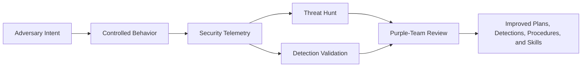

# Platform Vision

## Purpose

M3HT4 creates a shared terrain where Blue, Red, and Purple teams can understand the same evidence from different operational perspectives.

The framework connects:

- adversary intent;
- controlled behavior;
- defender-visible telemetry;
- hunt hypotheses;
- detection opportunities;
- engagement planning;
- lessons learned.

## Product definition

> **M3HT4 is an interactive cybersecurity framework that helps Blue, Red, and Purple teams build shared familiarity with security data, threat hunting, adversary behavior, and Purple-team engagement planning.**

It is not primarily a course, a home-lab showcase, an exploit repository, or an exhaustive intelligence database.

## Primary audiences

| Audience | Core need | M3HT4 response |
|---|---|---|
| Blue Team | Understand evidence and improve defensive coverage | Hunt and detection workflows |
| Red Team | Build realistic, safe, visibility-aware plans | Emulation planning and expected-evidence mapping |
| Purple Team | Connect intent, evidence, coverage, and improvement | Shared scenarios and after-action artifacts |

## Distinguishing characteristics

### Shared data perspective

The same scenario is viewed through Blue, Red, and Purple lenses instead of being documented separately for each role.

### Evidence-centered design

M3HT4 emphasizes what activity should look like in security data—not merely which action occurred.

### Curated maintenance model

Scenarios are added only when they are useful, validated, explainable, and maintainable.

### Private validation, public framework

A controlled private environment may generate evidence, but public users should not need access to that environment.

## Value chain

## Long-term direction

M3HT4.com will provide a polished public entry point and, over time, a guided interactive framework. GitHub remains the transparent source for documentation, templates, version history, issues, and contributions.
