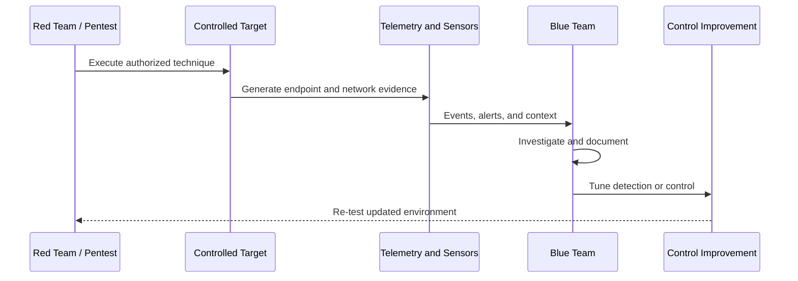

# Blue, Red, and Purple Team Operations Model

M3HT4 is designed for complementary offensive and defensive workflows.

## Blue-team outcomes

- Collect endpoint and network telemetry
- Engineer and tune detections
- Investigate alerts and suspicious activity
- Practice threat hunting
- Validate segmentation and identity controls
- Exercise incident-response and recovery procedures
- Produce defensible investigation reports

## Red-team and pentest outcomes

- Perform authorized reconnaissance and enumeration
- Validate vulnerabilities safely
- Practice exploitation in controlled systems
- Exercise privilege escalation and lateral movement
- Analyze attack paths
- Collect evidence and document findings
- Produce clear remediation-focused pentest reports

## Purple-team outcomes

- Map exercises to MITRE ATT&CK
- Confirm whether activity generated expected telemetry
- Measure which controls detected or prevented techniques
- Tune detections and network policy
- Re-run scenarios to validate improvements
- Preserve repeatable exercise plans and findings

## Guardrails

- Testing is limited to systems owned by the operator or explicitly authorized
- Offensive networks are segmented from management and household systems
- Potentially destructive actions require snapshots, backups, and recovery plans
- Public documentation uses sanitized examples
- Real access paths, credentials, and exploitable operational details remain private
