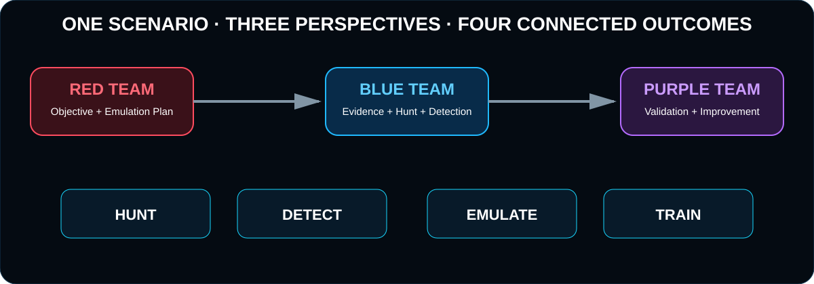
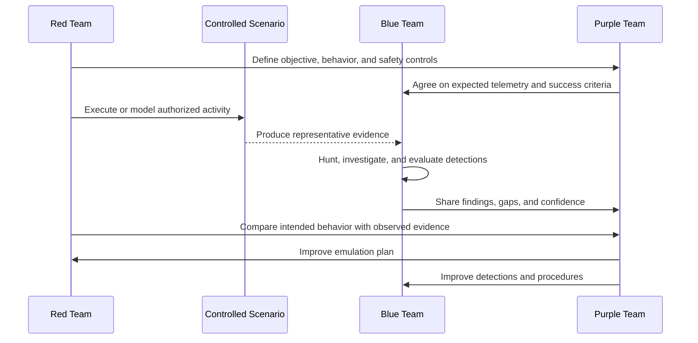

# Operating Model

M3HT4 uses one shared scenario to support three team perspectives and four operational pillars.

## Core engagement loop

## Scenario package

Each mature M3HT4 scenario should be a small, maintainable package rather than a large data dump.

| Component | Purpose |
|---|---|
| Scenario overview | Explains the objective, scope, assumptions, and expected learning value |
| Behavior map | Describes relevant adversary behavior using neutral, reusable terminology |
| Data guide | Identifies representative sources, important fields, and known limitations |
| Hunt path | Provides questions and pivots without replacing analyst reasoning |
| Detection notes | Captures visibility opportunities, validation ideas, and tuning considerations |
| Emulation plan | Defines authorized steps, prerequisites, expected evidence, and stop conditions |
| Purple plan | Connects objectives, actions, data, detections, and success criteria |
| Findings template | Records evidence, confidence, gaps, lessons learned, and improvements |

## Role-based outcomes

### Blue Team outcome

A defensible investigation package containing:

- hypothesis;
- data sources used;
- pivots and timeline;
- evidence and counter-evidence;
- conclusion and confidence;
- detection or visibility recommendations.

### Red Team outcome

A controlled emulation plan containing:

- objective;
- assumptions and prerequisites;
- behavior to emulate;
- safety boundaries and stop conditions;
- expected host, identity, network, or application evidence;
- success and failure criteria.

### Purple Team outcome

An engagement package containing:

- agreed objectives;
- test sequence;
- expected versus observed evidence;
- detection and process gaps;
- prioritized improvements;
- retest plan.

## Quality checks

Before publishing a scenario, confirm that:

- it adds value to at least two teams and clearly supports the third;
- it maps to one or more pillars without duplicating existing content;
- representative data is sanitized and legally publishable;
- instructions cannot accidentally target unauthorized systems;
- claims distinguish observed facts from assumptions;
- outputs remain useful without the private lab;
- the maintenance burden is reasonable.
