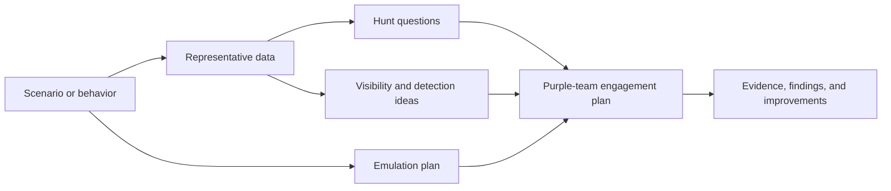
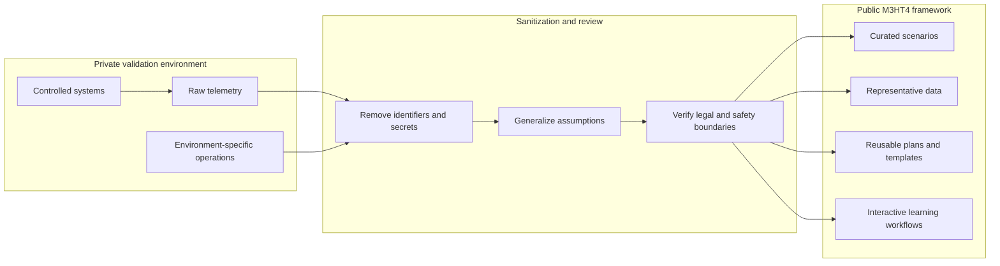

# Platform Vision

## Definition

**M3HT4 — Modern Hunting Terrain** is an interactive cybersecurity framework that helps Blue, Red, and Purple teams become more familiar with security data, threat hunting, adversary behavior, detection opportunities, and collaborative engagement planning.

Its purpose is not to reproduce an entire enterprise or catalog every known vulnerability. Its purpose is to provide a clear, reusable terrain where different security disciplines can examine the same behavior and produce connected outputs.

> **Built for 3 Teams. Powered by 4 Pillars.**

## The problem

Cybersecurity disciplines are often taught and practiced in separate silos:

- defenders see alerts and telemetry but may not understand the offensive intent behind them;
- red-team practitioners build plans but may not know what evidence defenders can realistically observe;
- purple-team engagements can become ad hoc when objectives, evidence, detections, and improvement actions are not connected.

M3HT4 aims to make those relationships visible and repeatable.

## The product idea

A user begins with a curated scenario, behavior, or objective. The framework then helps the user move through connected views:

The same content should support multiple levels of experience—from someone learning how to read the data to a practitioner drafting a structured engagement plan.

## Three teams

### Blue Team

M3HT4 helps defenders:

- recognize useful telemetry and its limitations;
- form and test hunting hypotheses;
- connect behavior to observable evidence;
- draft, test, and tune detection ideas;
- document investigation timelines and conclusions;
- understand how adversary objectives shape activity.

### Red Team

M3HT4 helps offensive practitioners:

- translate objectives into authorized emulation steps;
- understand what defenders are likely to observe;
- define expected evidence before execution;
- identify prerequisites, safety limits, and stop conditions;
- build plans that are useful to purple-team partners;
- avoid treating successful execution as the only measure of value.

### Purple Team

M3HT4 helps collaborative teams:

- create shared objectives and success criteria;
- align emulation steps with telemetry and detection expectations;
- compare expected versus actual visibility;
- record gaps without assigning blame;
- prioritize detection, process, and plan improvements;
- produce repeatable engagement artifacts.

## Four pillars

### Hunt

Investigate representative security data through structured questions, timelines, pivots, and hypotheses.

### Detect

Turn evidence into testable ideas for visibility, alerting, analytics, and defensive validation.

### Emulate

Build safe, authorized plans that represent adversary behavior and define expected defensive evidence.

### Train

Use guided scenarios and role-based views to improve practical understanding—not merely memorize definitions.

## What makes M3HT4 different

M3HT4 is intended to be:

- **Cross-functional:** the same scenario supports Blue, Red, and Purple perspectives.
- **Evidence-centered:** actions, claims, and improvements connect to observable data.
- **Curated:** depth and maintainability matter more than catalog size.
- **Interactive:** users should make decisions, inspect artifacts, and produce outputs.
- **Vendor-neutral where practical:** concepts should transfer across tool stacks.
- **Safe by design:** public content is sanitized and the public application remains isolated from private infrastructure.
- **Useful beyond training:** outputs should support real planning, validation, and professional development.

## What M3HT4 is not

M3HT4 is not intended to be:

- a live malware-upload service;
- an exploit marketplace;
- a replacement for commercial SIEM, EDR, cyber-range, or threat-intelligence products;
- an exhaustive CVE, actor, campaign, or TTP database;
- a public interface into a private home lab;
- a platform that depends on AI-generated conclusions without analyst review;
- a collection of disconnected tools added only because they are popular.

## Public and private boundaries

The private validation environment may be used to generate, study, and verify representative data. Public outputs should contain only what is required to teach or demonstrate the framework.

## Success criteria

M3HT4 is succeeding when a user can:

1. understand what behavior is being examined;
2. recognize relevant data and limitations;
3. build a defensible hunting or detection hypothesis;
4. create an authorized emulation plan with expected evidence;
5. connect both sides into a measurable purple-team engagement;
6. leave with reusable artifacts and a clearer mental model.
