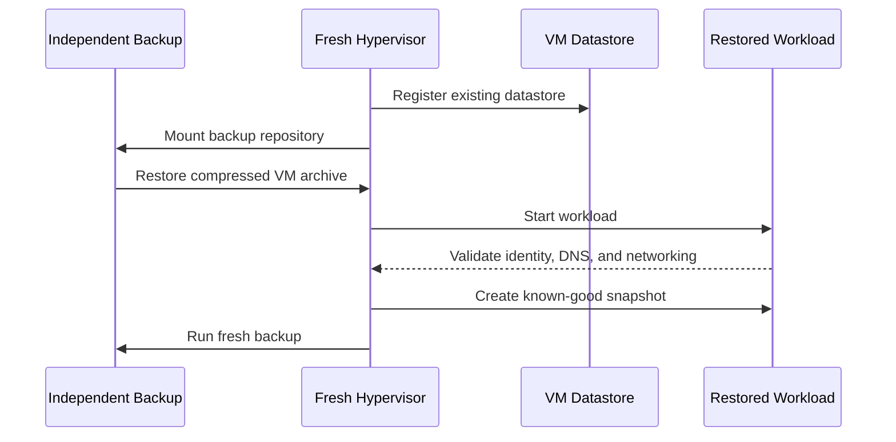

# Backup and Recovery

M3HT4 uses complementary recovery layers.

| Layer | Purpose |
|---|---|
| Snapshot | Rapid rollback before risky changes |
| Independent backup | Recovery from VM, datastore, or host failure |
| Documentation | Repeatable rebuild and validation |
| Restore test | Proof that the backup actually works |

## Validated result

The infrastructure milestone included a successful end-to-end recovery:

1. Hypervisor rebuilt
2. Storage re-registered
3. Backup repository mounted
4. Critical VM restored
5. Compatibility issue resolved
6. Workload started and validated
7. New snapshot created
8. Automated backup completed successfully
