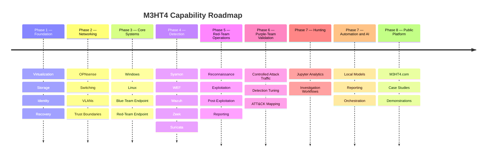

# M3HT4 Roadmap

## Phase 2 — Enterprise networking

- Deploy dedicated OPNsense firewall
- Integrate managed switching
- Implement trust zones
- Establish controlled management access
- Preserve household connectivity during migration
- Log and validate inter-zone traffic

## Phase 3 — Core systems

- Windows enterprise endpoint
- Linux services
- Offensive testing workstation
- Controlled vulnerable systems

## Phase 4 — Detection engineering

- Endpoint telemetry
- Centralized Windows event collection
- Network metadata and IDS
- SIEM dashboards
- Detection validation

## Phase 5 — Red-team and penetration-testing operations

- Authorized reconnaissance and enumeration
- Vulnerability validation and exploitation practice
- Privilege escalation and lateral-movement exercises
- Post-exploitation evidence collection
- Attack-path documentation
- Pentest-style findings and reporting

## Phase 6 — Purple-team validation

- Controlled attack execution
- MITRE ATT&CK technique mapping
- Telemetry and alert validation
- Detection tuning
- Segmentation and control testing
- Repeatable purple-team exercise reports

## Phase 7 — Threat hunting

- Hypothesis-driven hunts
- Jupyter notebooks
- Structured datasets
- Investigation timelines

## Phase 8 — Automation and AI

- Local AI-assisted triage
- Sigma and YARA assistance
- Report generation
- Experiment orchestration

## Phase 9 — M3HT4.com

- Public architecture
- Project case studies
- Detection demonstrations
- Threat-hunting showcases
- Links to the public repository
