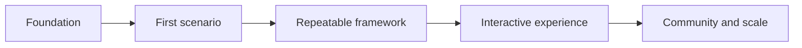

# Roadmap

M3HT4 follows an incremental delivery model designed to avoid premature complexity.

## Phase 1 — Foundation

- Finalize project identity, vision, guardrails, and repository structure.
- Maintain a safe validation environment.
- Establish publication and licensing checks.

## Phase 2 — First complete scenario

- Define the scenario schema.
- Validate representative evidence.
- Produce Blue, Red, and Purple outputs.
- Publish a sanitized case study.

## Phase 3 — Repeatable framework

- Convert the first scenario into reusable templates.
- Add a small number of varied scenarios.
- Improve documentation navigation and quality controls.

## Phase 4 — Interactive experience

- Launch the documentation-first M3HT4.com experience.
- Add guided scenario exploration.
- Add structured planning and export features only after the content model is stable.

## Phase 5 — Community and scale

- Define contribution standards for scenarios and detections.
- Add validation automation where it reduces maintainer burden.
- Evaluate sustainable hosting and support models.

