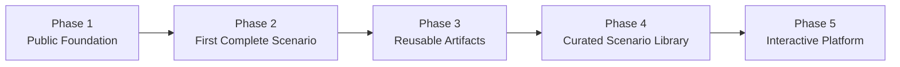

# Delivery Roadmap

M3HT4 follows an incremental strategy: build a small useful artifact, validate it, publish it safely, and only then expand.

## Phase 1 — Public foundation

- finalize Modern Hunting Terrain branding;
- define the 3 Teams and 4 Pillars;
- align public documentation;
- establish public/private boundaries;
- eliminate broken navigation and stale positioning.

## Phase 2 — First complete scenario

- define one authorized objective;
- map behavior to expected evidence;
- validate representative telemetry;
- document a hunt workflow;
- identify detection opportunities;
- publish a sanitized Purple-team after-action review.

## Phase 3 — Reusable framework artifacts

- scenario brief;
- evidence map;
- hunt plan;
- emulation plan;
- detection-validation record;
- after-action review;
- improvement backlog.

## Phase 4 — Curated scenario library

- add only validated scenarios;
- tag scenarios by team, pillar, objective, and evidence source;
- document limitations and prerequisites;
- review and retire stale content.

## Phase 5 — Interactive platform

- searchable scenarios and artifacts;
- Blue, Red, and Purple perspectives;
- guided engagement planning;
- interactive evidence relationships;
- lightweight and maintainable hosting.

## Delivery rule

> The application should follow validated workflows—not attempt to invent them before they exist.
