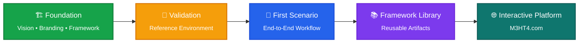

# Development Roadmap

> [!WARNING]
> M3HT4 is in early development. The current repository establishes the public identity, framework model, and delivery direction; it is not yet a mature hosted platform.

## Current maturity

| Workstream | Status | Meaning |
|---|:---:|---|
| Modern Hunting Terrain identity | ✅ Established | Official name and public definition |
| 3 Teams / 4 Pillars model | ✅ Established | Core organizational model |
| Public/private safety boundary | ✅ Established | Publication rules and architecture separation |
| Public documentation baseline | 🟡 In progress | Pages are being aligned and expanded |
| Private validation environment | 🟡 In progress | Supports controlled evidence generation |
| First complete scenario | 🔵 Planned | Next major public proof point |
| Reusable artifact templates | 🔵 Planned | Follow the first validated scenario |
| Interactive application | 🔵 Future | Built after workflows are proven useful |

## Immediate next milestone

Publish one complete, sanitized scenario containing:

- authorization and scope;
- representative adversary behavior;
- expected evidence;
- a Blue-team hunt workflow;
- detection-validation notes;
- a Red-team emulation plan;
- a Purple-team after-action review;
- reusable lessons and improvement items.

## The M3HT4 Journey

M3HT4 is being built incrementally. Each milestone adds a complete, validated capability before expanding to the next.

### Current focus

M3HT4 is currently focused on building a **strong foundation**:

- ✅ Establish the framework vision
- ✅ Define the 3 Teams and 4 Pillars
- 🟡 Build and validate the reference environment
- 🟡 Publish the first complete end-to-end scenario

Rather than building a large collection of incomplete content, M3HT4 prioritizes **small, validated milestones** that can be expanded over time.

## Available today

- clear public vision;
- cross-team operating model;
- reference architecture;
- phased roadmap;
- publication-safety standard.

## Not available yet

- mature scenario catalog;
- production hosted application;
- exhaustive threat or vulnerability database;
- guaranteed public release dates.
