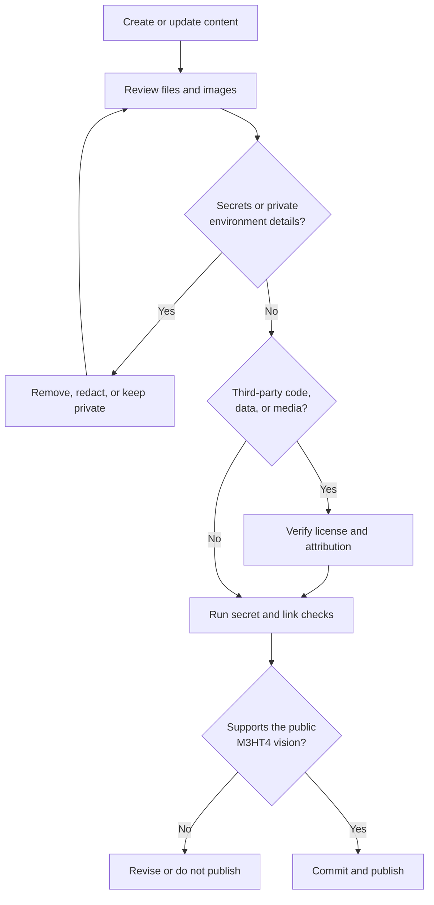

# Publication Safety

M3HT4 is public. Every contribution should be reviewed as though it may be indexed, copied, and retained permanently.

## Safe to publish

- generalized architectures;
- sanitized examples and scenarios;
- fictional or reserved identifiers;
- vendor-neutral workflows;
- original or properly licensed content;
- lessons learned without identifying private systems or people.

## Keep private

- credentials, tokens, API keys, private keys, and recovery codes;
- authentication cookies or session material;
- real internal IP addresses, hostnames, domains, UUIDs, MAC addresses, or serial numbers;
- VPN configuration, management paths, or firewall rules exposing access;
- raw private packet captures, memory dumps, backups, or VM images;
- cloud/account identifiers and private certificates;
- environment-specific details that materially increase risk.

## Approved placeholder patterns

```text
host.example.lab
192.0.2.10
AA:BB:CC:XX:XX:XX
<REDACTED_UUID>
<REDACTED_TOKEN>
```

## Publication workflow


