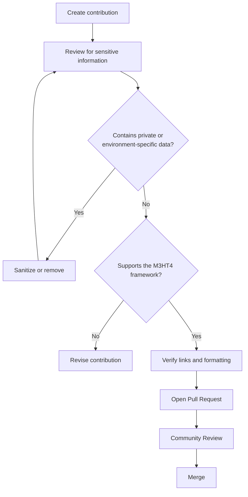

# Safe Contribution Guidelines

M3HT4 is a public, open-source cybersecurity framework. Every contribution should be suitable for public release and should support the project's focus on **authorized defensive security, threat hunting, adversary emulation planning, and collaborative learning**.

These guidelines help ensure the repository remains safe, professional, and useful to the broader cybersecurity community.

---

## What belongs in this repository

Contributions should prioritize:

- Public-safe documentation
- Sanitized scenarios and examples
- Threat hunting workflows
- Detection engineering concepts
- Adversary-emulation planning
- Purple-team collaboration
- Vendor-neutral guidance where practical
- Original work or properly licensed content

---

## What should never be committed

Do **not** include:

- Credentials, API keys, tokens, or secrets
- Internal IP addresses or network diagrams
- VPN or firewall configurations
- Private certificates or cryptographic keys
- Packet captures containing sensitive data
- Virtual machine images or backups
- Memory dumps
- Customer or organizational information
- Environment-specific operational details

When in doubt, **leave it out**.

---

## Sanitization standards

Before submitting a contribution:

- Replace environment-specific information with placeholders.
- Use fictional hostnames and reserved IP address ranges.
- Remove any information that could identify a real environment.
- Verify screenshots do not expose sensitive details.

Example placeholders:

```text
host.example.lab
192.0.2.10
AA:BB:CC:XX:XX:XX
<REDACTED_UUID>
<REDACTED_TOKEN>
```

---

## Before opening a Pull Request

Use this checklist before submitting changes:

- [ ] No credentials or secrets are included
- [ ] No private infrastructure details are exposed
- [ ] Examples are sanitized
- [ ] Third-party content is properly licensed
- [ ] Links render correctly
- [ ] Documentation is clear and accurate
- [ ] Content supports the M3HT4 framework

---

## Contribution Review

Every contribution should improve at least one of the following:

- 🔵 Blue Team workflows
- 🔴 Red Team planning
- 🟣 Purple Team collaboration
- 🔎 Hunt
- 🛡️ Detect
- ♟️ Emulate
- 📘 Train

If a contribution doesn't strengthen one of these areas, it may not align with the goals of M3HT4.

---

## Contribution Workflow



---

## Our Goal

M3HT4 is intended to be a trusted public resource for cybersecurity professionals, students, and researchers.

Every contribution should improve the framework while protecting privacy, respecting licensing, and promoting responsible, authorized security practices.
