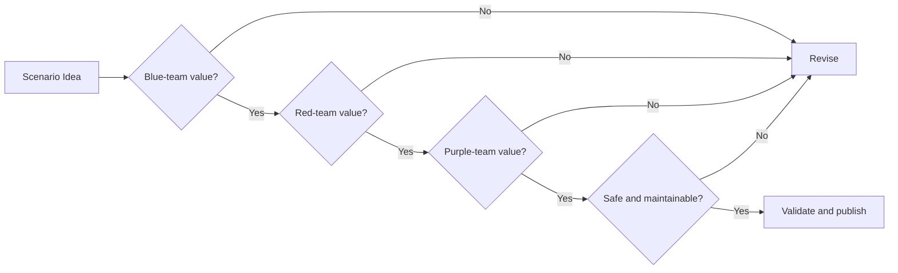

# Sanitized Examples

This directory will contain public scenarios and reusable artifacts after they have been validated and sanitized.

## Planned example structure

```text
examples/
└── scenario-name/
    ├── README.md
    ├── scenario-brief.md
    ├── evidence-map.md
    ├── hunt-plan.md
    ├── emulation-plan.md
    ├── detection-record.md
    └── after-action-review.md
```

## Example requirements

Every example must:

- define an authorized objective;
- use fictional or reserved identifiers;
- explain expected evidence;
- include Blue, Red, and Purple perspectives;
- map to one or more M3HT4 pillars;
- document assumptions and limitations;
- avoid real credentials, endpoints, or private infrastructure details.

## Scenario value test


