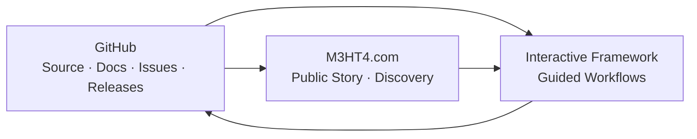

# M3HT4.com Direction

M3HT4.com will become the polished public home for Modern Hunting Terrain.

## Main website

The main site will:

- explain the framework to a broad audience;
- introduce the 3 Teams and 4 Pillars;
- show validated scenarios and outcomes;
- direct technical readers to GitHub;
- establish a credible project and future business presence.

## Future interactive framework

The interactive experience may eventually provide:

- guided scenario navigation;
- Blue, Red, and Purple perspectives;
- behavior-to-evidence mapping;
- hunt and detection planning;
- adversary-emulation planning;
- Purple-team engagement artifacts;
- reusable learning paths.

## Relationship between public surfaces

GitHub remains the source of truth. M3HT4.com becomes the polished public experience. The private validation environment remains separate from both.
