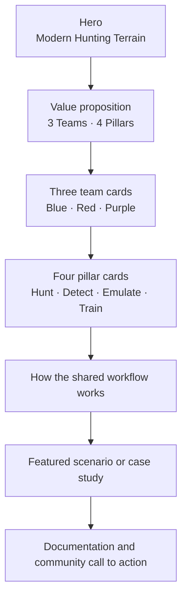

# M3HT4.com Website Direction

M3HT4.com will be the public home of **M3HT4 — Modern Hunting Terrain**.

The site should explain the framework in business-friendly language while giving technical visitors a clear path into the documentation and future interactive application.

## Primary message

> **Built for 3 Teams. Powered by 4 Pillars.**
>
> M3HT4 helps Blue, Red, and Purple teams understand security data, hunt threats, plan adversary emulation, validate detections, and improve together.

## Recommended site structure

1. **Home** — concise value proposition, 3 Teams, 4 Pillars, and a clear call to explore
2. **How It Works** — visual framework flow from behavior to evidence to improvement
3. **For Blue Teams** — data familiarity, threat hunting, detection, and investigation
4. **For Red Teams** — defender visibility and adversary-emulation planning
5. **For Purple Teams** — engagement planning, validation, findings, and retesting
6. **Scenarios** — curated future interactive workflows
7. **Documentation** — public methodology, templates, and case studies
8. **About** — project story, responsible-use principles, and open-source approach

## Homepage wireframe

## Visual direction

- Dark, professional cybersecurity aesthetic consistent with the banner
- Strong contrast and clean typography
- Blue, red, and purple used intentionally for team identity
- Cyan/blue accents for neutral framework elements
- Diagrams that explain relationships before long blocks of text
- Minimal animation; clarity and speed over visual noise
- Responsive layout with accessible text and contrast

## Deployment boundary

The website and future public application must be hosted separately from the private validation environment.

Do not expose:

- virtualization, firewall, switch, identity, or remote-management interfaces;
- private addresses, origin endpoints, VPN details, or management paths;
- private datasets, raw captures, credentials, tokens, or keys.

Use managed/static hosting, HTTPS, least-privilege deployment credentials, and separate public data stores where required.
